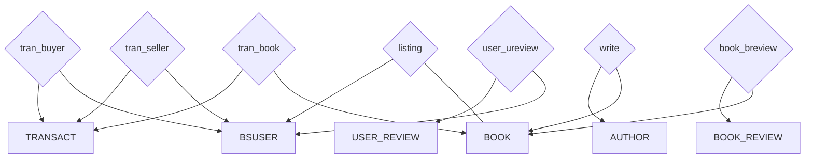

# SQLite_Bookstore

```mermaid
graph TD
user[BSUSER]
auth[AUTHOR]
book[BOOK]
ur[USER_REVIEW]
br[BOOK_REVIEW]
tran[TRANSACT]
buy{tran_buyer}
sell{tran_seller}
tb{tran_book}
write{write}
u_r{user_ureview}
b_r{book_breview}
list{listing}
buy-->tran
buy-->user
sell-->tran
sell-->user
tb-->tran
tb-->book
write-->auth
write-->book
u_r-->ur
u_r-->user
b_r-->br
b_r-->book
list-->user
list---book
```