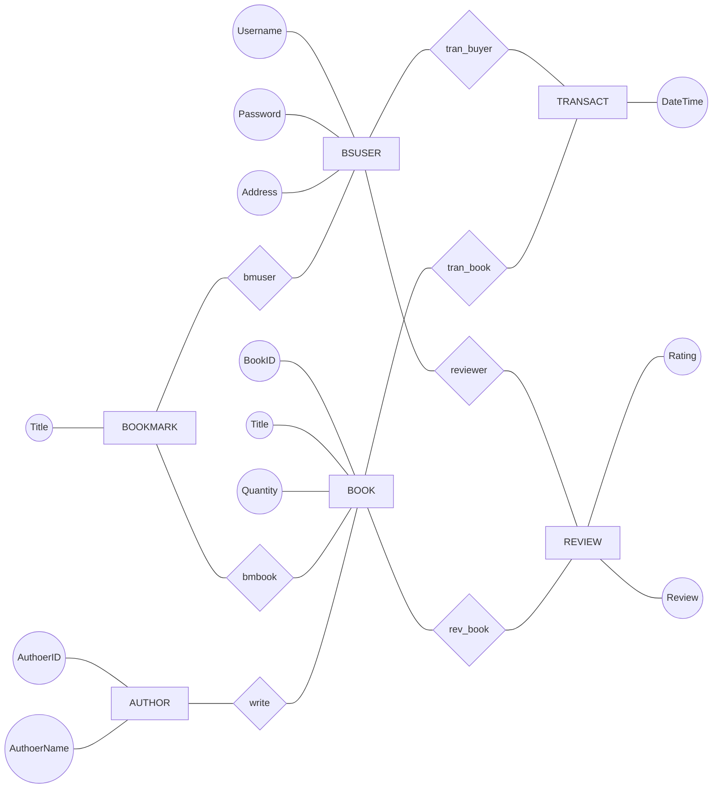

# SQLite_Bookstore

```mermaid
graph LR
user[BSUSER]
uu((Username))---user
up((Password))---user
ua((Address))---user
auth[AUTHOR]
ai((AuthoerID))---auth
an((AuthoerName))---auth
book[BOOK]
bi((BookID))---book
bt((Title))---book
bq((Quantity))---book
rev[REVIEW]
rev---rb((Rating))
rev---rr((Review))
tran[TRANSACT]
tran---tt((DateTime))
bmark[BOOKMARK]
mt((Title))---bmark
user---tbu{tran_buyer}---tran
book---tbo{tran_book}---tran
user---rer{reviewer}---rev
book---ree{rev_book}---rev
bmark---bu{bmuser}---user
bmark---bb{bmbook}---book
auth---wri{write}---book
```